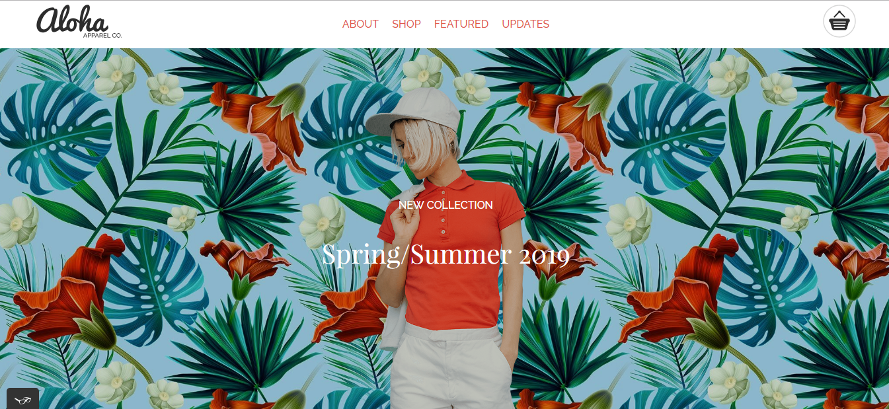
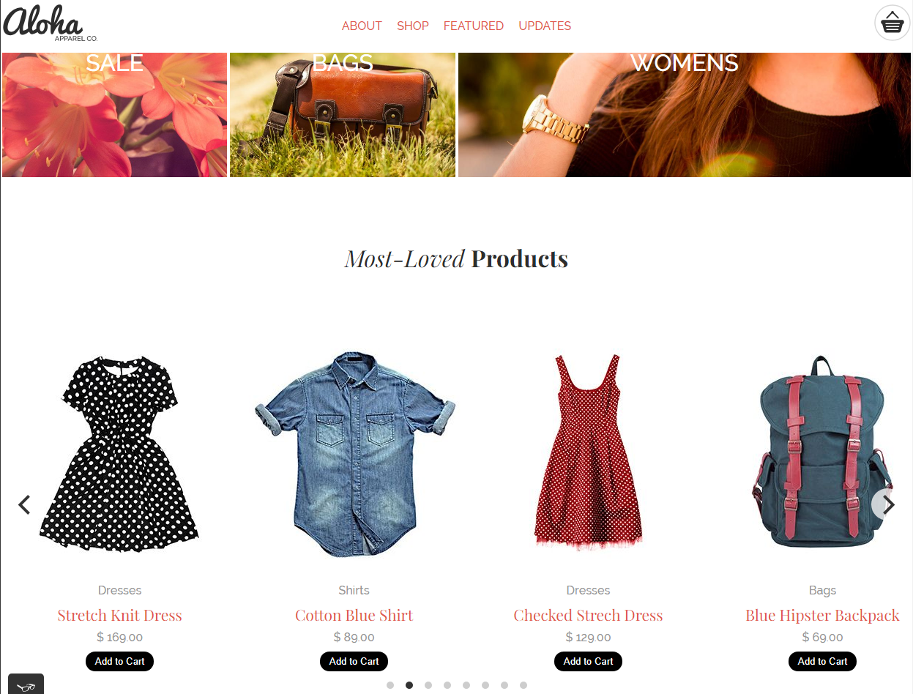
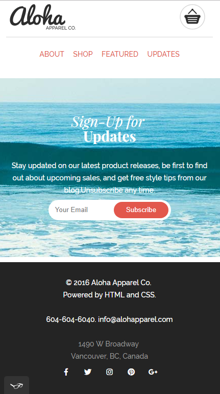

# Aloha project

This is a project to showcase HTML , CSS and Javascript skills to build a responsive website as part of the Web Developer Professional Program at RED Academy.

## See page @:

https://ekaynak94.github.io/project-01-aloha-webpage/

## Screenshots

### Site Banner

### Site Products Section

### Mobile View

## Skills Learned

- Web Page Development in Visual Studio
- Google Chrome Developer Tools
- Responsive Webdesign
- Semantical HTML markup usage
- CSS:
  Page Styling
  Media Queries
  Font Faces
  Flexboxes
- Fontawesome icons
- Google Fonts
- Coding in Javascript and using Jquery
- Usage of Plugins(Flickity)
- Usage of Git/Github

## Personal Experience

- This was the first Website I have built as a part of the RED Academy Web Developer Professional Program. We had been provided with the screenshots of the webpage and how the design looks on different window sizes, as well as the image files used on the page to start off the project. I have learned a great deal about how to develop a simple responsive web page, how to style it and how to add functionalities to the page with javascript.
